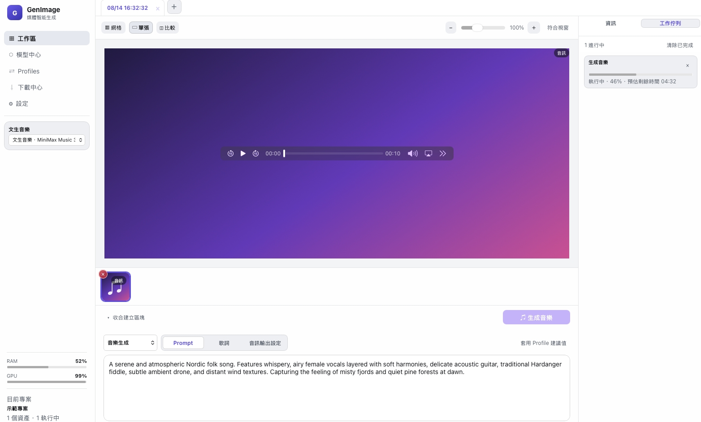

# GenMedia

繁體中文 | [English](README.en.md) | [日本語](README.ja.md) | [한국어](README.ko.md)

GenMedia 是一款**原生支援 Apple Silicon** 的本機 AI 媒體生成 App。目前專案已建立可編譯的混合式應用程式：

- Swift 負責模型、Profile、工作佇列、檔案與 MLX／Core ML 推論。
- `WKWebView` 內嵌 HTML、CSS 與 JavaScript UI，不需要網路或 npm runtime。
- 文生圖、圖生文、圖生圖、文生影、圖生影、文生音樂與 Upscale 都可獨立執行，也可以透過資產來源關係串接。
- 每次操作保存 Profile 快照，模型或架構更新後仍可追蹤當時的版本。
- 獨立設定頁支援繁體中文、英文、日文、韓文及六套可持久保存的配色。
- 標準 JSON-RPC 2.0 stdio MCP server 可供其他 Agent 或自動化工具呼叫。

## 預覽



## 執行

需求：macOS 14+、Apple Silicon、Xcode 16+。

```bash
./build.command
./run.command
```

`build.command` 會建立 Release 執行檔，並在 `dist/` 輸出標準 `GenMedia.app`。App 內含 WebUI 資源、MLX Metal runtime、MCP server 及模型診斷工具。

```bash
# 建置 Release 執行檔與 App
./build.command

# 只做增量 Release 建置，不建立 App bundle
./build.command --no-app

# 指定版本與 Bundle ID
GENIMAGE_VERSION=1.1.0 GENIMAGE_BUNDLE_ID=com.example.genimage ./build.command
```

`run.command` 會自動使用 `--no-app`，日常啟動不會重複建立 App bundle。對外發佈的 DMG 由獨立本機流程完成 Developer ID Application 簽章、Apple Notarization、Staple 與 Gatekeeper 驗證。

### 影片 Runtime

影片生成使用可替換的 `ltx-2-mlx` 外部 Runtime；Swift App 負責 Profile、參數驗證、工作佇列、取消、進度、資產與影片播放。第一次使用前安裝 CLI 與 FFmpeg：

```bash
brew install uv ffmpeg
./scripts/install-ltx-runtime.command
```

App 會依序尋找 `GENIMAGE_LTX_RUNTIME`、`GENIMAGE_LTX_RUNTIME_ROOT/.venv/bin/ltx-2-mlx`、App Helpers、`~/.local/bin/ltx-2-mlx`、常見 Homebrew 路徑及 `PATH`。若執行檔位於自訂位置，可指定：

```bash
GENIMAGE_LTX_RUNTIME="/absolute/path/to/ltx-2-mlx" ./run.command
```

`ltx-2-mlx` 預設會使用其 Gemma 文字編碼器設定；已有本機 Gemma 模型時可透過 `GENIMAGE_LTX_GEMMA_MODEL` 指定模型目錄或 Hugging Face ID。App 的 DMG 目前不內含 Python Runtime、Gemma 權重或 FFmpeg，正式散佈時應將其視為選用外部元件，並分別確認 Runtime 與模型授權。

### Civitai LoRA

模型中心也提供數個以 `ZImageTurbo` 為基底的 Civitai LoRA（Asian Beauties、Turbo Lightning、Flat AnimeStyle、Diorama）。Civitai 下載端點依創作者設定可能要求登入；若下載回應 401，請在啟動 App 前設定個人 Civitai API Token：

```bash
CIVITAI_TOKEN="your-civitai-api-token" ./run.command
```

Token 只會透過 HTTPS `Authorization: Bearer` 標頭傳給 Civitai，不會寫入模型 manifest 或專案檔案。

### Profile、工作佇列與記憶體

- Profile 依「使用中、可用、下載中、不可用」排序；模型與 LoRA 相依項目完整時使用淡綠色外框，下載完成後會立即重新排序。
- 工作取消會先進入 `cancelling`，Runtime Task 結束後自動轉成 `cancelled` 並解除所有生成與記憶體按鈕。ETA 在進度 35% 且執行滿 15 秒後顯示數字，樣本不足時會使用整體耗時備援估算。
- Z-Image MLX 量化相容層支援 `quantize_config.json`、affine／mxfp4、packed pad token 與 FP16→BF16 載入修正；`build.command` 會在解析 Swift Package 後自動套用 `Patches/` 內的 Runtime 修正。andrevp Z-Image Turbo MLX 4-bit 已完成實際生成驗證。
- 文生圖完成後保留模型權重與暖機 buffer；5 分鐘後只清理可重用的 MLX 暫存 buffer，不卸載模型。按下側欄「釋放記憶體」、切換模型，或切換 Profile 時 RAM 超過 90%，才會卸載不再需要的 Runtime。
- 下載保留來源原始檔名；生成輸出使用 `Image-YYYYMMDD-HHmm`、`Video-YYYYMMDD-HHmm` 或 `Music-YYYYMMDD-HHmm`，同分鐘重複時自動加上流水號，並可在設定頁更改輸出目錄。
- 每個開啟的工作區分頁視為一個生成專案；資產與 lineage 會原子寫入 Application Support，App 關閉後仍可恢復。只有明確關閉分頁時才移除該專案的工作區索引，已輸出的媒體檔仍保留於磁碟。
- Prompt 與歌詞編輯期間會保留游標、選取範圍及輸入法組字狀態；生成類型、Prompt、歌詞與輸出設定 TAB 只局部更新創作面板。必要的完整畫面更新會沿用播放中的音訊或影片節點，避免中斷播放。

### 音樂 Runtime

文生音樂由 `MusicGenerationRouter` 依 Profile 分派至 ACE-Step 1.5 或 MiniMax Music 3 Adapter。Swift App 統一管理音樂風格、可選 Prompt、可選歌詞、步數、Seed、工作取消、時間推估及音訊資產資訊；Prompt 留空時使用所選音樂風格，歌詞留空時生成純音樂。各 Runtime 產生的暫存 WAV 都由共用 FFmpeg 輸出層轉為 MP3、M4A、AAC 或 FLAC。

- **ACE-Step 1.5 Turbo MLX**：建議 Profile，透過 App 內建的 Apple Silicon 原生 Swift／MLX Runtime 生成 10～300 秒歌曲或純音樂，不需要安裝額外服務。程式與模型採 MIT License，可商業使用；長音訊採重疊分塊 VAE 解碼以控制記憶體用量。

- **MiniMax Music 3 MLX 8-bit**：透過外部 `mlx-minimax-music3` CLI 執行，設定值是 5～300 秒的最長長度；模型可依歌曲結構提前自然結束，完成後 App 會顯示實際生成長度。模型仍適用其 Community License。

ACE-Step 原生 Runtime 隨 App 提供；模型、MiniMax Music 3 Runtime 與 FFmpeg 維持外部選用元件。

## 驗證

```bash
swift test

for file in Sources/GenImageApp/Resources/WebUI/js/*.js; do
  node --check "$file"
done
```

診斷本機模型與自動建立的 Profiles：

```bash
swift run GenImageDoctor

# 或指定自訂模型目錄
GENIMAGE_MODEL_ROOT="/path/to/models" swift run GenImageDoctor
```

啟動標準 MCP stdio server：

```bash
.build/arm64-apple-macosx/release/GenImageMCP
```

MCP 支援 `initialize`、`ping`、`tools/list`、`tools/call`，工具包含本機模型、Profile、原生 Z-Image 文生圖、Qwen3-VL 圖生文與 Core ML Upscale。

已完成 MCP 端到端實測：`genimage_generate_image` 可使用本機 Z-Image Turbo Q4 輸出 PNG；`genimage_describe_image` 可用 Qwen3-VL 輸出繁體中文描述；`genimage_upscale_image` 可使用本機 Real-ESRGAN Core ML 模型輸出 4× 圖片。

## 專案結構

```text
Sources/
├── GenImageCore/
│   ├── DomainModels.swift        # 資產、配方、工作、模型與 Profile
│   ├── InferenceServices.swift   # 圖片、文字、影片與音樂推論服務介面
│   ├── ModelCatalog.swift        # 內建模型及 Profile
│   ├── OutputFileNaming.swift    # 圖片、影片與音樂輸出命名
│   ├── ProjectWorkspacePersistence.swift # 開啟中生成專案持久化
│   └── WorkflowGraph.swift       # 資產來源與分支關係
├── GenImageRuntime/
│   ├── ZImageTextToImageService.swift
│   ├── QwenVLImageDescriptionService.swift
│   ├── Qwen2511ImageToImageService.swift
│   ├── LTXVideoGenerationService.swift
│   ├── MusicGenerationRouter.swift
│   ├── ACEStepMusicGenerationService.swift
│   ├── MiniMaxMusic3GenerationService.swift
│   ├── AudioOutputEncoder.swift
│   └── CoreMLUpscaleService.swift
└── GenImageApp/
    ├── AppStore.swift            # 應用程式狀態與工作協調
    ├── HybridBridgeController.swift
    ├── HybridWebView.swift
    ├── AssetSchemeHandler.swift  # 安全提供本機圖片、影片與音訊給 Web UI
    └── Resources/WebUI/          # HTML/CSS/JavaScript 前端
Patches/                           # 建置時套用的 Z-Image MLX 相容性修正
```

## 目前狀態

App 已接入真實本機推論：Z-Image Turbo 文生圖、Qwen3-VL 圖生文、Qwen 2511 圖生圖、LTX-2.3 MLX 文生影／圖生影、ACE-Step 1.5 Turbo MLX 與 MiniMax Music 3 MLX 8-bit 文生音樂，以及 Core ML Real-ESRGAN Upscale。影片以 MP4 加入工作區；音樂可輸出 MP3、M4A、AAC 或 FLAC，並保存實際時長、取樣率、聲道、Profile 快照與 lineage。

更多資訊：

- [更新紀錄](UpdateNote.md)
- [架構說明](docs/ARCHITECTURE.md)
- [Web Bridge](docs/WEB_BRIDGE.md)
- [開發路線](docs/ROADMAP.md)
- [MCP 介面](docs/MCP.md)
- [本機模型測試](docs/MODEL_TEST_REPORT.md)

## 授權

本專案採 GPLv3 與商業授權雙軌：

- 開源使用依 [GNU General Public License v3.0](LICENSE) 授權。
- 若要在無法或不願遵守 GPLv3 的情境下使用，例如閉源整合、專有產品發行或需要客製商業條款，請聯絡著作權人另行取得商業授權。
